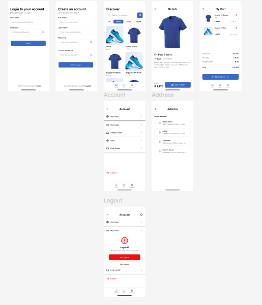

# 🛍️ Nexora — E-Commerce App

A modern **E-Commerce mobile application** built with **Flutter**.
The app provides a clean shopping experience with product browsing, categories, product details, and a local shopping cart.

## ✨ Features

* 🏠 Browse products
* 🔎 Product search UI
* 🏷️ Browse products by categories
* 🛍️ Add products to cart
* ➕ Increase product quantity
* ➖ Decrease product quantity
* 🗑️ Remove products from cart
* 💰 Calculate subtotal and total price
* 📦 Product details screen
* 🔄 Pull-to-refresh products
* ✨ Shimmer loading effect
* 🎬 Smooth screen and list animations
* 🖼️ Cached network images
* 🔐 Login and Register screens
* 👤 Account screen
* 📍 Address screen
* 📱 Responsive UI using ScreenUtil

## 🛠️ Tech Stack

* **Flutter**
* **Dart**
* **Flutter Bloc / Cubit**
* **Dio**
* **REST API**
* **GetIt** — Dependency Injection
* **GoRouter** — Navigation
* **Cached Network Image**
* **Shimmer**
* **Google Nav Bar**
* **Flutter ScreenUtil**
* **Flutter Staggered Animations**
* **Google Fonts**
* **Gap**

## 🏗️ Architecture

The project follows a feature-based structure with separation between UI, state management, repositories, models, and core services.

```text
lib/
│
├── core/
│   ├── networking/
│   ├── routing/
│   ├── styling/
│   ├── utils/
│   └── widgets/
│
├── features/
│   ├── account/
│   ├── address/
│   ├── auth/
│   ├── cart/
│   ├── home_screen/
│   ├── main_screen/
│   ├── product_screen/
│   └── splash_screen/
│
└── main.dart
```

## 🌐 API

The application uses the **Platzi Fake Store API** for products and categories.

Base URL:

```text
https://api.escuelajs.co/api/v1
```

The API is used for:

* Products
* Categories
* Authentication
* Product details

### 🛒 Cart

The API used in this project does not provide the cart functionality required by the application.

Therefore, the cart is currently managed locally using **CartCubit**.

This allows users to:

* Add products
* Change quantities
* Remove products
* Calculate the cart total

without depending on a cart endpoint.

## 📦 Installation

Clone the repository:

```bash
git clone https://github.com/Abdowasfy/e_commerce.git
```

Navigate to the project:

```bash
cd e_commerce
```

Get dependencies:

```bash
flutter pub get
```

Run the application:

```bash
flutter run
```

## 📸 Screenshots



```text
screenshots/
├── home.png
├── product_details.png
├── cart.png
├── login.png
└── account.png
```

## 🚀 Future Improvements

* 💳 Payment integration
* ❤️ Wishlist
* 🔍 Fully functional product search
* 🔔 Notifications
* ☁️ Persistent cart storage
* 📦 Order history
* 👤 Complete profile management
* ⭐ Product reviews and ratings
* 🌐 Connect cart and orders to a backend

## 👨‍💻 Author

**Abdelrahman Mohamed Wasfy**

Flutter Developer

GitHub: **Abdowasfy**

---

⭐ If you like this project, consider giving it a star!
